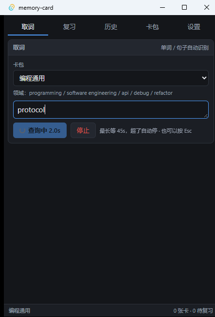
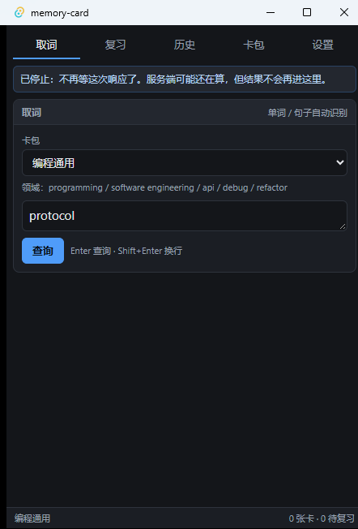
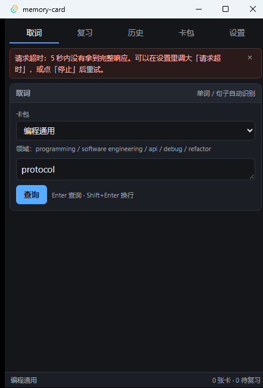
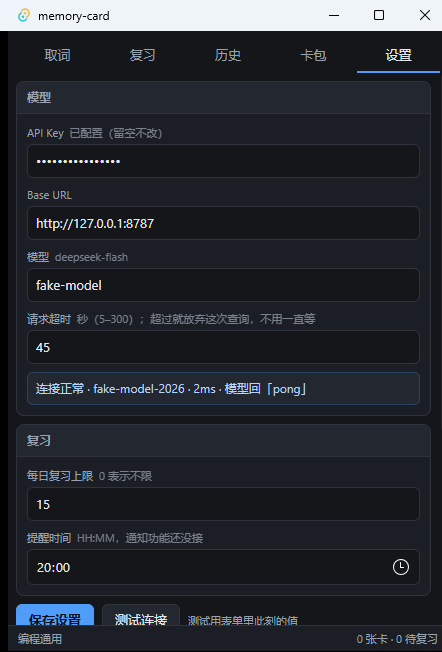
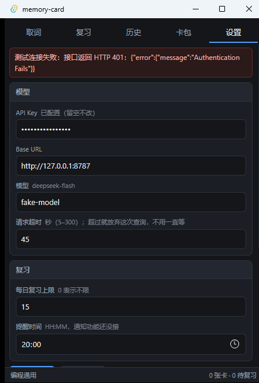
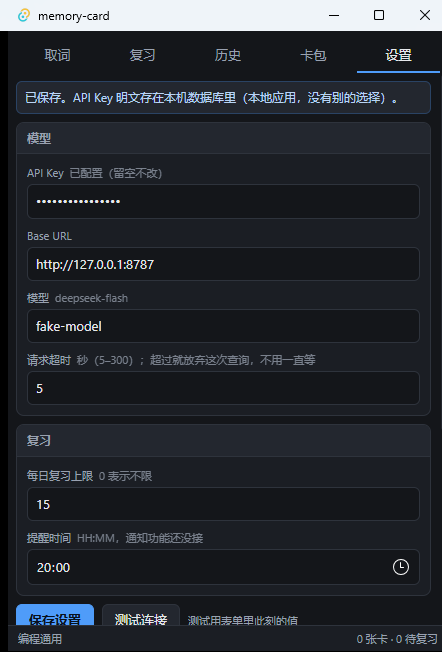

# 验证记录

最后验证：2026-09-20（第三轮：请求可控 —— 查询可停止 / 超时可配置 / 设置页连通性测试；见 §8。此前：v0.1 骨架期；拖拽取词；UI/交互改版；release 打包；第二轮缺陷复修 + 0.1.1 打包复验）

**结论**：取词 → 域释义 → 入卡 → 复习 → 历史 全链路在**真实窗口**里跑通；后端 18 条命令逐条执行过；自动化测试全绿、0 warning。第三轮补的三件事（停止 / 超时 / 连通性测试）也在真实窗口里驱动验过 —— 但**只用本机假模型验的**，真 API 上的取消没试过，限定条件写在 §5。

**取词两条路径**：手动粘贴（已实现、已验证）与拖拽入窗（**已实现**，分类器有单元测试覆盖，用户已在真实窗口确认「放下即查」可用）。剪贴板监听仍按 PRD §2 非目标不做。

**重要限定**：

* **一键入库部分达成 PRD P0 #5。** `Enter 存入` / `Esc 丢弃` 已实现（输入框内 `Enter` 查询、`Shift+Enter` 换行；结果出来后、焦点不在输入框时 `Enter` 入库），主操作固定在底部常驻动作栏；`E 编辑后存入` **未实现**（没有释义手工编辑界面）。
* 别把下面的结论读成这个工具已经好用 —— 它只说明管道是通的。

## 1. 自动化测试

| 命令 | 结果 |
|---|---|
| `cargo test`（src-tauri） | **17 个单元测试通过**（SM-2 调度 + prompt 构造 10 个；第三轮新增 7 个：取消 / 超时 / 传输层错误重试 / `ping` 成功 / `ping` 报 401 / 已取消的令牌不碰网络 / 超时值两端 clamp），0 failed，0 warning。其中 6 个在本机 127.0.0.1 上起假服务器，不联网、不花 token |
| `cargo test --test live_llm -- --nocapture` | **1 个联网集成测试通过**（3.44s） |
| `npx tsc --noEmit` | 通过 |
| `pnpm build`（vite） | 通过 |
| `pnpm tauri build --debug --no-bundle` | 通过，产出 `src-tauri/target/debug/memory-card.exe` |
| `pnpm tauri build`（release + 打包，先 `Remove-Item Env:CI`） | 通过，2m50s；产出独立 exe + `bundle/msi/*.msi` + `bundle/nsis/*-setup.exe` |
| `node --test scripts/check-dragdrop.ts` | **10 个分类器测试通过**（输入过滤 + 拖拽分派：词框 / 句子框 / 整段 / 跨行 / 代码行 / 路径 / URL / 纯数字 / base64 / 中文 / 空串 —— 第四轮从 7 个扩到 10 个，见 §9.4） |

联网测试的原始输出（它断言 `handle` 在 rust 卡包下给的是句柄义，而不是通用词典的"把手"）：

```text
[live] handle -> 对某个异步任务、资源或运行时对象的引用/句柄，持有它就能查询状态、等待完成或对其进行操作 | 1895ms | 输出 249 tokens
[live] bounded -> cache_hit=256 cache_miss=162
```

第二行是**前缀缓存确实生效**的证据：`bounded` 这次请求有 256 个输入 token 命中缓存、162 个未命中 —— 命中的正是两个请求共享的固定前言 + 卡包作用域。缓存价是未命中价的 1/50，这是这个工具能便宜的前提。

没配 key 时 `live_llm` 自动跳过，所以无脑跑 `cargo test` 不会因为缺 key 而红。

**release 打包复验（同日）**：`Remove-Item Env:CI` 后 `pnpm tauri build` 成功（后端冷编译 `cargo build --release` 2m50s，随后 WiX 出 MSI、makensis 出 NSIS）。产物：

| 产物 | 字节 | SHA256 |
|---|---|---|
| `target/release/memory-card.exe` | 6,765,568 | `F666FDE4…E554FB99` |
| `bundle/msi/memory-card_0.1.0_x64_en-US.msi` | 3,375,104 | `00F6FE64…1E3057D9` |
| `bundle/nsis/memory-card_0.1.0_x64-setup.exe` | 2,444,622 | `1A9962E8…DFFF160F83` |

三个产物都是 PE32+ x64（NSIS 外壳是 32 位存根，属正常），`Get-AuthenticodeSignature` 均为 `NotSigned`。**只验证了独立 exe**：把 cwd 设成不含 `.env` 的临时目录再启动 `target/release/memory-card.exe`，进程存活、窗口标题 `memory-card`、`DwmGetWindowAttribute` 给出 664×977 物理 / 144 DPI(150%) = 440×620 逻辑（与 `tauri.conf.json` 一致），界面完整渲染（五页标签 + 底部状态栏 `23 张卡 · 18 待复习`，见 §4），未配 key 也不崩 —— 说明 `frontendDist` 已被打进二进制、配置确实从 SQLite 读。**MSI 与 NSIS 安装包没有真跑安装**（不在这台机器上装）。

**release 0.1.1 打包复验（同日第二轮，修完 §7 的缺陷之后）**：`Remove-Item Env:CI` 后重跑 `pnpm tauri build`，`Finished release profile in 1m 42s` + `Finished 2 bundles`。产物与哈希：

| 产物 | 字节 | SHA256 |
|---|---|---|
| `release/0.1.1/memory-card.exe` | 6,765,568 | `EBEF2518…632ED0` |
| `release/0.1.1/memory-card_0.1.1_x64_en-US.msi` | 3,375,104 | `B060BEB2…273CF7` |
| `release/0.1.1/memory-card_0.1.1_x64-setup.exe` | 2,445,182 | `97A0F982…6F1163B1` |

完整值在 `release/0.1.1/SHA256SUMS.txt`（该目录 gitignore，和 `release/0.1.0/` 一样）。三个副本与 `target/` 里的原件逐字节比对通过（`Get-FileHash` 相等）。PE 机器码：`memory-card.exe` = `0x8664`(x64)、NSIS `setup.exe` = `0x014C`(32 位存根，正常)。**更正上一轮的写法**：MSI 不是 PE 文件（它是 OLE 复合文档），上一轮把它也写成"PE32+ x64"是错的。

这一轮**真的把发布版跑起来验了**（不是只 `pnpm tauri dev`）：把 `release/0.1.1/memory-card.exe` 改名成 `mc-rel011.exe` 拷到临时目录（cwd 不含 `.env`）启动，它照常从 `%APPDATA%` 读库（`25 张卡 · 20 待复习`），然后驱动真实窗口走了一遍 §7 的场景 —— 结论：§7 的两个修复**在发布二进制里生效**（见 §7.4 的 `release-02`…`release-04`）。

**UI/交互改版后的复验（同日）**：改版只动前端（`src/App.tsx`、`src/views/*`、`src/styles.css`，以及 `src/dragdrop.ts` 的提示文案），后端与 prompt **未动**。重跑：`npx tsc --noEmit`（通过）、`pnpm build`（通过）、`node --test scripts/check-dragdrop.ts`（7/7 通过）。改版内容 —— 底部常驻动作栏（主操作不再随内容滚动）、取消"单词 / 句子"开关（改由分类器自动判断）、卡包下拉只显名称（领域关键词移到下方一行）、释义按"场景概要 → 细节 → 通用义"重排并默认隐藏 `why_translation_fails`、出结果后收起输入区。已在真实窗口里驱动验证并留下 §4 的四张新截图。

顺手改掉的两个真问题（都是"驱动真实窗口"才暴露的）：

* 出结果后 `Enter` 会抢走焦点所在控件（按钮 / 标签页）的按键 —— 键盘 Tab 到"复习"再按 Enter 变成了入库。已把 `Enter = 主操作` 限制为"焦点不在任何可交互控件上"时生效（`src/views/LookupView.tsx`）。实测：结果页 Tab 到"复习"再 Enter 会正常切页，不会入库。
* `scripts/shot-window.ps1` 在 150% 缩放下会截错区域/裁掉右下半张图（`GetWindowRect` 给的是 DPI 虚拟化后的坐标，`CopyFromScreen` 也照此裁）。本轮改用 `DwmGetWindowAttribute(DWMWA_EXTENDED_FRAME_BOUNDS)` 拿物理尺寸 + `PrintWindow(..., 2)` 截图。**脚本本身当时没改**，第二轮已把这段逻辑抽到 `scripts/win-shot.ps1` 并让两个脚本都 dot-source 它（见 §7）。

## 2. 端到端：16 条命令逐条执行

不是"能编过"，是每一条都在真实窗口里操作过一遍：

| 命令 | 观察到的结果 |
|---|---|
| `list_decks` | 启动即用，6 个种子卡包出现（编程通用 / 前端 / Rust 后端 / AI·LLM / 网络协议 / GitHub 协作黑话） |
| `create_deck` | 建包并要求填关键词；不填关键词时界面直接拦下 |
| `update_deck` | 改关键词生效，已有释义不自动重算 |
| `delete_deck` | 删包后卡包列表与队列计数同步更新 |
| `lookup_term` | `handle` 与 `bounded` 各查一次，**覆盖了模型请求与本地缓存命中两条路径** |
| `save_lookup` | 存入「编程通用」；重复存入一个已存在的词，`reps` / `due_at` 未被重置 |
| `list_cards` | 卡片列表出现 2 张 |
| `delete_card` | 删掉一张，列表与计数同步 |
| `list_history` | 刚才两次查询都在，可按词或按释文搜到 |
| `list_due_cards` | 新卡 `due_at = now`，立刻进队列，显示 `1/1` |
| `review_card` | 评分 3 → 间隔变为 1 天 → 标签栏的到期角标消失 |
| `reactivate_card` | 被休眠的逾期卡可手动恢复 |
| `get_stats` | 卡数 / 待复习数正确 |
| `get_settings` | API key 回显为 `***configured***`，不回传明文 |
| `save_settings` | 改 key 落库，后续请求用新值 |
| `db_location` | 返回 `%APPDATA%\memorycard\memory-card\data\memory-card.db` |

两处**领域义正确性**的实例（截图里可见）：

* `handle` 给的是"处理、应对（事件、请求、错误、数据等）"，上下文能点出通用义"触摸、拿、操作"在编程语境下不合用。（模型仍返回 `why_translation_fails`，但按 P3 修订已不再默认展示。）
* `bounded` 给的是"有明确上限、有界循环、有界延迟"，对照通用义"有边界的"。

## 3. 过程中发现并修掉的真 bug

对着截图逐张看才发现的三处，都是"看代码时觉得对、看画面时才发现不对"的类型：

| 现象 | 根因 | 修法 |
|---|---|---|
| 存卡提示写死"首次复习 10 分钟后"，但新卡其实立刻到期 | 文案是硬编码的，没跟 `due_at` 走 | 改为按真实到期时间显示，并补"（现在就可以复习）" |
| 新卡在复习页显示"上次间隔 0 分钟" | `interval_days` 对未复习过的卡是 0，被当成历史值渲染 | `reps === 0` 时显示"新卡" |
| 间隔显示成 `1.0 天` | 浮点直接格式化 | 整数不补小数位 |

发布之后用户上手用，又报回两处（外加我自己顺手抓到的第三处），见 **§7**。

## 4. 证据

截图来自真实窗口，由 `scripts/ui-drive.ps1` 驱动、`scripts/shot-window.ps1` 抓取（只截窗口，不截桌面）。

| 文件 | 说明 |
|---|---|
|  | 查 `handle`，置信度 high，右上角「缓存」标记说明这条释义来自本地 `def_cache` 而非重新请求模型 |
|  | 存 `bounded` 入「编程通用」，入卡提示已按 bug 修复后的形式显示；底部来源行给出 `2017ms / 输出 252 tokens / 前缀缓存 256/424 tokens` |
|  | 复习页对新卡显示"新卡"而非"上次间隔 0 分钟" |

UI 改版后的四张（同一轮 `pnpm tauri dev` 真实窗口，由 `scripts/ui-drive.ps1` 驱动）：

| 文件 | 说明 |
|---|---|
|  | 取词首屏：卡包下拉**只显名称**，领域关键词另起一行；**没有"单词 / 句子"开关**，标题栏写明"单词 / 句子自动识别"；无结果时底部无动作栏 |
|  | 出结果后：输入区**收成一行**；释义顺序＝领域义（hero）→ 在这句话里 → 例句 → 常见搭配 → **通用含义（弱化收尾）**；**没有"为什么通用翻译会错"**；底部常驻动作栏「存入「编程通用」」**不滚动即可点**（其上方内容已溢出，正说明动作栏确实固定） |
|  | 复习正面：`翻面（空格 / Enter）`固定在底部动作栏；此处也是"结果页 Tab 到别的标签页再按 Enter 会切页而不是入库"的现场 |
|  | 复习背面：`1–4 忘了/勉强/记得/秒答`评分行整体移入底部动作栏；正文同样是"领域义 → 细节 → 通用含义"且无 `why` |

release 打包产物的一张（`pnpm tauri dev` 之外的独立进程，cwd 不含 `.env`）：

| 文件 | 说明 |
|---|---|
|  | `target/release/memory-card.exe` 独立启动：界面完整（不是白窗）、底部状态栏 `23 张卡 · 18 待复习` 说明 SQLite 正常打开、卡包/领域行正常 |

这张抓图用的是 `DwmGetWindowAttribute(DWMWA_EXTENDED_FRAME_BOUNDS)` 取物理框 + `PrintWindow(hwnd, hdc, 2)`（`PW_RENDERFULLCONTENT`，否则 WebView2 会截出空白）—— 曾经是内联写法，现在这段逻辑已经落进 `scripts/win-shot.ps1`，`shot-window.ps1` / `ui-drive.ps1` 都 dot-source 它，两处不会再漂移。

## 5. 仍未验证 / 仍未实现

**仍未验证**：

* **真 API 上的「停止」没按过**（第三轮新增，见 §8）：取消 / 超时 / 测试连接三件事全部是对着 `scripts/fake-llm.mjs`（`127.0.0.1:8787`）验的。取消的机制是"丢掉 future = 丢掉连接"，跟服务端是谁无关；但要真按一次，得把真 key 填进界面、再抓准 2–10 秒的响应窗口，没做。
* **用户截图里的 `error decoding response body` 只被"像"地复现过**：`--mode truncate` 能让应用走进同一条传输层解码失败的分支（并重试到 2/2 次），但当时那份报文没抓到。本机代理（坑 10）是头号嫌疑，**没有证据链**。
* **拖拽取词的端到端驱动**：分类器过滤规则有 `node --test scripts/check-dragdrop.ts` 覆盖，用户也已在真实窗口确认「拖一下即出释义」可用；但尚未用 `scripts/ui-drive.ps1` 留证据截图（§4 的三张截图不含拖拽）。
* **「补充句子」的拖拽路径没有真实窗口证据**（第四轮新增，见 §9）：`classifyDrop` 的分派规则有单元测试，但"拖一段文字进窗口 → 落进句子框"这条端到端路径没截图 —— HTML5 拖拽没法用 `ui-drive.ps1` 模拟。这一轮验的是"手打 / 粘贴进两个框"。
* **第四轮全部对着假模型**（第四轮新增，见 §9）：验的是"哪个框把什么传了下去"（假模型日志逐次打印 `term=` / `sentence=`）和界面显示规则。真 API 上没跑过 —— 真模型回什么形状的 `in_context` 不在这一轮的验证范围里。
* **`scripts/ui-drive.ps1` 的交互限制**（§7 末尾 + §8 末尾）：坐标点击**不会**让多行 `textarea` 获得焦点（§7 的结论）；但**单行 `input` 是可以的** —— 第三轮就是用"点一下 `input` → `^{a}` → `-Paste`"把「请求超时」改成 5 的。第四轮点 `textarea`（句子框）却**能**聚焦（§9.6 最后一条），与 §7 的结论不一致 —— 两次各留一次观察，等第三次验完再改脚本注释。另外 `-Keys "{ENTER}"` **不激活按钮**（对着按钮发回车，界面毫无反应，看着像保存失败），要点按钮就点它的坐标。`-Keys` 里连续 `{TAB}` 会被丢掉（发 10 次落地约 2 次），要 TAB 就一次只发一个。这些都已写进脚本注释。
* **句子流程 B**：UI 已去掉"单词 / 句子"开关（改由分类器自动判断），但"整句大意 + 难点词列表、逐条入卡"**未实现** —— 句子与单词仍共用同一个单次释义 prompt。抽词质量**没实测**。
* **几十张卡规模下的复习性能与滚动体验**没压测。
* **费用**：只在单次查询尺度上看过 token 数，没有按天累计的账 —— "第三轮那几十次查询花了 0"是设计如此（假服务器不往外发请求），不是记账记出来的。`cargo test` 里那 6 个假服务器测试同样 0 费用、毫秒级。
* 未做同类工具对照（EasyDict / Bob / GoldenDict / Anki / 沉浸式翻译）。

**仍未实现**：

* **一键入库的 `E 编辑后存入`**（P0 第 5 项）：`Enter 存入` / `Esc 丢弃` 已实现；`E 编辑后存入` 未实现 —— 缺释义手工编辑界面（P1 第 10 项）。
* **托盘图标与到期通知**：`Cargo.toml` 里开了 `tauri` 的 `tray-icon` feature，但没有任何托盘代码 —— 目前只是把编译开关打开了，功能不存在。
* 剪贴板监听**已移出范围**（PRD §2 非目标），不再列为待办。原先"按下 Ctrl+C 就出释义"的那套体验设计与成功指标随之作废。

## 6. 自己复现

```powershell
# 1. 只验模型侧（不发 Tauri，最省事）
pwsh scripts/probe-deepseek.ps1 -DryRun      # 先看请求体，不发请求
pwsh scripts/probe-deepseek.ps1              # 真发一次，打印耗时 / 缓存 / confidence

# 2. 自动化测试（前端分类器在仓库根跑）
node --test scripts/check-dragdrop.ts

cd src-tauri
cargo test
cargo test --test live_llm -- --nocapture

# 3. 出独立 exe 再看真实窗口
cd ..
pnpm tauri build --debug --no-bundle
# 注意：必须传仓库根作 cwd，否则 dotenvy 找不到 .env
$exe = "$PWD\src-tauri\target\debug\memory-card.exe"
([wmiclass]'Win32_Process').Create($exe, $PWD.Path, $null)

# 4. 离线复现"卡住 / 超时 / 停止 / 401 / 测试连接"（不联网、不花 token）
node scripts/fake-llm.mjs --port 8787 --mode hang      # 只收不答；还有 truncate / unauthorized / ok
Copy-Item $exe .verify\mc-verify.exe                   # 改名：别和用户手上那个同名（坑 9）
$env:NO_PROXY = '127.0.0.1,localhost'                  # 否则 Clash 会把本机请求转走（坑 10 / §8.5）
$env:MEMORY_CARD_DB = "$PWD\.verify\fake.db"           # 独立库，不碰 %APPDATA% 那份
$env:DEEPSEEK_BASE_URL = 'http://127.0.0.1:8787'
([wmiclass]'Win32_Process').Create("$PWD\.verify\mc-verify.exe", $PWD.Path, $null)
# 之后用 scripts\ui-drive.ps1 -ProcessName mc-verify 驱动真实窗口（-ClickAt 点按钮最可靠）
```

一个会让上面第 3 步白费的坑：**跑过 `cargo test` 之后必须先重新 `pnpm tauri build`**，否则 exe 是编译期指向 `devUrl`(1420) 的那个版本，窗口会直接报 `ERR_CONNECTION_REFUSED`。详见 [DEVELOPMENT.md](DEVELOPMENT.md)。

## 7. 缺陷复修（2026-09-19 第二轮）

第一轮验证是"按 PRD 走一遍"，全绿；这一轮是**用户拿 `release/0.1.0` 双击起来真用**之后报回来的。三个问题都有同一个味道：**页面在动、数据也在，但两者对不上**。

### 7.1 切页丢结果（用户报：切标签页再回「取词」，全空了）

**根因**：`App.tsx` 里五个视图是条件渲染（`tab === "lookup" ? <LookupView/> : …`），切页就是**卸载**。`LookupView` 的 `input` / `result` / `saved` 全在组件局部 state 里 —— 组件没了，状态就没了，回来的是一张崭新的取词页。动作栏是一个副作用注册，组件一卸载它也一起消失。

**修法**：把取词页改成**常驻挂载、只切 `display`**（`<div hidden={tab !== "lookup"}>`，`styles.css` 的 `.content` 补 `[hidden]{display:none}` 防止被自己的 display 规则盖掉）。其余页仍按需挂载 —— 历史必须重新查库才能看到刚存的卡、复习必须重新查库才能看到刚到期的卡，卸载是它们的正确行为，只有取词页的结果没有第二次机会。

常驻的代价是后台页会一直抢动作栏和全局键盘，所以补了一个显式契约：`useActionBar(node, deps, active = true)`，`active` 为假就不注册；取词页的 keydown 监听开头 `if (!active) return`。**没有这一步，在复习页按 `Esc` 会把后台那张取词页的结果清掉** —— 这是改完之后新引入又立刻修掉的问题，试出来的（见 7.4）。

### 7.2 已有卡却说"存入"（用户报：历史点一条，下面还提示存入）

**根因**：后端 `lookup_term` **本来就返回** `existing_in_deck`，前端拿到了却没人用 —— 动作栏文案是写死的「存入「deck」」。于是同一屏上，入卡面板写着"当前卡包已有这个卡"，底下的主按钮却写着"存入"。

**修法**：`const existing = result?.existing_in_deck ?? null;`，有卡时主操作变成「**更新**「deck」释义」，旁边补一句只读的「已有卡 · 复习 N 次」；没卡时还是「存入「deck」」。存完的提示也改成用后端返回的 `saved.deck_name`（JOIN 出来的真值），而不是 `result.deck_name` —— 见 7.3，这两者会不一样。

### 7.3 存进哪个卡包（顺带查出来的第三处）

**根因**：动作栏文案用的是 `result.deck_name`，而 `save()` 用的是 App 那个下拉框的 `deckId` —— 两者可以不同。更麻烦的是这个不同**有实质后果**：`term_key` 里嵌了 `deck_id`，释义又是按卡包关键词算出来的，存到别的卡包既跨了领域、又会多出一张卡。

**修法**：

* `save()` 改为存入 `result.deck_id`（`deps` 收成 `[result, onSaved]`，不再依赖下拉框状态）。
* 从历史点一条时，`pickHistory` 连卡包一起切（`pickDeck(item.deck_id)`），卡片上下的卡包是一致的。

验证方式：把下拉框留在「前端」、结果却来自「编程通用」，点存入 —— 卡片进了「编程通用」。截图 `ui-09`。

### 7.4 证据（全部来自真实窗口）

改动涉及前端 + 脚本，后端与 prompt 未动。重跑 `npx tsc --noEmit`（0 退出）、`pnpm build`（30 modules，247.94 kB / gzip 77.93 kB）。

前半组是**修改前 / 修改后的对照**，同一个动作：从「历史」点一条已经存在的 `integrity`（它属于「编程通用」）。取证用的是一个**改名的调试副本 `mc-probe.exe`**（当时用户正开着自己的 `memory-card.exe`；进程名一样的话 `-ProcessName` 会挑错窗口、`Stop-Process` 也可能误伤）：

| 文件 | 说明 |
|---|---|
|  | **修改前**切回「取词」看到的东西：输入框回到展开的空态、没有释义、底部动作栏也不在 —— 和刚启动时**长得一模一样**，所以这个 bug 光看画面很难和"本来就没查过"区分开（bug 1） |
|  | **修改后**：同一串操作之后，`integrity` 的释义、`已有卡 · 复习 0 次`、「更新「编程通用」释义」都还在 |
|  | **修改前**：从历史点一条**已经有卡**的记录，底部主按钮写的是「存入「编程通用」」（bug 2） |
|  | **修改后**：同一动作变成「更新「编程通用」释义」+「已有卡 · 复习 0 次」，左侧卡包也切成 `编程通用` |
|  | **存入目标**：卡包下拉框停在「前端」，释义却是按「编程通用」算的；点存入后底部写「已更新「编程通用」· integrity」—— 卡片进的是这条释义的卡包，不是下拉框此刻那个 |
|  | **布局 bug（修改前）**：卡包名被释义挤成一列竖排字「编 / 程 / 通 / 用」，整行还横向溢出 |
|  | **修改后**：卡包名「编程通用」完整一行，省略号落在释义上，一屏能多看两行 |

（`ui-06` 与后面的 `release-04`、`ui-08` 与 `release-03` **逐字节相同** —— 同一份前端产物、同一个确定性画面，一次抓自修复后的调试副本、一次抓自发布 exe。`Get-FileHash` 一样不是抓重了，是画面真的没有差别。）

顺带修掉的历史页布局问题：`.history-def` 是 `nowrap` 的 flex 项，默认 `min-width:auto` 让它撑到 min-content（=整行），被挤扁的反而是旁边的卡包名。给 `.history-def` 补 `min-width:0`、给卡包名补 `flex:0 0 auto` 之后，省略号才落在释义上。

还验到的两点：后台那张取词页的 `Esc` **不会**清掉它的结果（切到复习页按 `Esc`，回取词页结果仍在）；复习页自己的动作栏与评分键没被 `active` 契约弄坏。

**上面这一组验的是调试版（`mc-probe.exe`）。** 光验调试版不够 —— 交付给用户的是发布版，打包配置和优化都可能改变行为。所以把 `release/0.1.1/` 里那个真·发布 exe 也跑了一遍（同样改名成 `mc-rel011.exe` 以避开同名进程）。**代价要说明白**：它用的是用户那份真实数据库（`%APPDATA%`），所以库里多了一条 `integrity` 的历史记录；这正是 DEVELOPMENT.md 坑 9 说的那种污染，下次应当先把 `data\` 复制一份出来再跑。

| 文件 | 说明 |
|---|---|
|  | `release/0.1.1/memory-card.exe` 独立启动（cwd 不含 `.env`）：界面完整、`25 张卡 · 20 待复习` —— 读的是真实数据库 |
|  | 发布版里从历史点一条：结果出来（右上角`缓存`，说明命中 `def_cache`、没花钱）、底部写「已有卡 · 复习 0 次」+「更新「编程通用」释义」、左下角卡包跟着变成`编程通用` |
|  | 发布版里切到`复习`再切回`取词`：**结果原封不动还在** |

这三张里没有任何键入动作 —— 是**从历史点一条**触发的查询。这也是被逼出来的：驱动脚本点文本框**不会**把焦点给它（见 7.5），所以"打字进输入框"这条路走不通，改用"点一条历史记录"绕开键盘。副作用是这条路同时把 7.2 / 7.3 一起验了。

### 7.5 修 bug 时踩到的取证工具问题

* `shot-window.ps1` 的 DPI 缺陷**这次真修了**：抽成 `scripts/win-shot.ps1`（`DwmGetWindowAttribute` 物理框 + `PrintWindow(...,2)` + `IsIconic` 守卫 + 采样 8 像素判断是否白窗），`shot-window.ps1` 与 `ui-drive.ps1` 都 dot-source 它，不再各写一份。
* `ui-drive.ps1` 的两条限制（本轮实测确认，已写进脚本注释）：**坐标点击不会让输入框获得焦点** —— 不是"间歇性失败"，是点了之后 `-Paste` 十次都不落（点击本身没问题，同一套坐标点标签页每次都对，映射早就校准过）；`-Keys` 里连续 `{TAB}` 会被丢掉（发 10 次大约只落地 2 次）。可靠的做法只剩"点按钮"。**要让它查出东西，别去纠结怎么把字弄进输入框，点一条历史记录就行** —— 取词页的入口本来就有两条，历史点击那条完全不需要键盘。
* 但"点历史"有个前提：库里得已经有记录。空库上这台机器跑不了纯驱动流程，那一段只能靠人手。
* 另外 `-ClickAt` 用的是**虚拟化后的** `GetWindowRect` 坐标 —— 这是故意的，因为 `SetCursorPos` 也是 DPI 不敏感的。截图不能照抄这套坐标（见 §5 / 坑 8）。
* 版本从 `0.1.0` 抬到 `0.1.1`（`package.json` / `tauri.conf.json` / `Cargo.toml`），好让修好的安装包和用户手上那个区分开。**不需要迁移**：数据在 `%APPDATA%`，identifier 没变。

还有一条**没查清的现象**，记在这里免得下次以为是幻觉。`release/0.1.1` 的 MSI 生成于 23:07:22；5 秒后的 23:07:27，Application 日志出现 `MsiInstaller` 的"已安装产品 memory-card 0.1.1，状态 0"。打包器自己不会装东西，那个时间点也没有人手工装过 —— 而现在机器上 `HKLM` / `HKCU` 的 Uninstall 键里**没有** memory-card 条目，也就是说此刻什么都没装上。同一时间点前，用户开着的那个 `Downloads\memory-card.exe` 实例也不在进程表里了。两件事**可能**相关（安装 MSI 会经 Restart Manager 关掉占用同款 WebView2 的进程），但我没有证据链，所以不写成结论。能确定的只有两点：**(1) 现在没有安装态残留；(2) 不该在用户正开着应用时再起实例去共用数据库**（坑 9）。

## 8. 第三轮：请求可控（2026-09-20）

用户报的三件事（带两张截图）：查询会卡住/超时、**没有手动停止的地方**（截图里的错误是 `error decoding response body for url https://api.deepseek.com/chat/completions`）、设置页的模型配置**没有连接测试**、以及需要一个能**防止请求拖太久**的东西（也就是可配置超时）。

### 8.1 根因（读代码读出来的，不是猜的）

| 症状 | 根因 | 位置 |
|---|---|---|
| 卡住时只能重启 | 前端只有"忽略过期结果"的 `abortRef`，请求在 Rust 侧照跑到底；压根没有取消通道 | `LookupView.tsx` |
| `error decoding response body` 直接冒到界面上 | 传输层错误（`send()` / `text()` 失败）用 `?` 直接上抛，**不进重试循环**（当时只对"空 content / 解析失败"重试） | `llm.rs::define()` |
| 超时改不了 | 45s 硬编码在 `default_client()` 的 `ClientBuilder::timeout` 上，是**客户端级**的、一建用一辈子 | `llm.rs::default_client()` |
| 没地方验 key | 设置页只有输入框，没有测试按钮 | `SettingsView.tsx` |
| 和 PRD 对不上 | PRD §9 早写了"设置页可编辑**并测试连通性**"，一直没落地 | `docs/PRD.md` §9 |

### 8.2 修法

后端：

* **取消令牌** `Cancel`（`Arc<AtomicBool>` + `tokio::sync::Notify`；通知用 `notify_one` **保存许可**，避免"先取消、后等待"的竞态）。`define()` / `ping()` 用 `select!`（biased）同时等「取消」和「超时」——**future 被丢掉就是连接被丢掉**，这是"停止"能立刻生效、而不是等服务端回话的原因。
* **超时**从客户端级移进 `LlmConfig.timeout`，含义变成**整次查词的总预算**（5–300s，默认 45，两端 clamp）；`default_client()` 只留 `connect_timeout`（10s）—— 客户端级超时会盖掉设置页改的值，必须让它不存在。
* **传输层错误进重试**（最多 2 次），错误信息按 `is_timeout` / `is_connect` / `is_decode` 分类成中文，并带上 `第 N/2 次尝试`。
* **`ping()`**：一次极短的 chat 请求，**故意不带**查词那套固定前言（免得污染前缀缓存），返回 `{reply, model, elapsed_ms}`。
* `AppState.lookups: Mutex<HashMap<String, RunningLookup>>`（300s TTL 清理）+ 命令 `cancel_lookup(request_id)` / `test_llm(settings)`；`lookup_term` 多一个 `request_id`。**停止可能比请求先到**，所以"登记 / 结束"必须成对，先到的取消要记账（否则界面停了、后台照样在烧 token）。命令总数 16 → **18**。

前端：

* 查询中按钮变 `查询中 2.0s`，旁边是「**停止**」+ `最长等 Ns，超了自动停 · 也可以按 Esc`；查询中 `Esc` 等于停止；停止后给一条提示条（"服务端可能还在算，但结果不会再进这里"）。
* 设置页加「请求超时」（5–300）与「测试连接」；成功显示 `连接正常 · {model} · {elapsed}ms · 模型回「pong」`，失败走错误条并把 HTTP 状态与响应体原文摆出来。

**prompt 一个字没动**，所以 `PROMPT_VERSION` 没 bump（前缀缓存的键保持稳定，本地释义缓存不失效）。

### 8.3 自动化测试

`cargo test` 从 10 个涨到 **17 个**（0 failed）。新增 7 个里 6 个在 `127.0.0.1` 上起假服务器（`llm.rs::fake_server`），不联网、不花 token，所以"卡住 30 秒"这种用例是毫秒级跑完的：

| 测试 | 断言什么 |
|---|---|
| `cancel_returns_at_once_instead_of_waiting_out_the_budget` | 令牌一按，原本要等满 30s 的查询立刻返回 `Cancelled` |
| `already_cancelled_token_never_touches_the_network` | 先停后查：假服务器**一次都没被连上**（不是"连上了再断"） |
| `hung_request_times_out_with_a_readable_message` | 假服务器只收不答 → 到点返回 `Timeout`，文案里带秒数 |
| `truncated_response_is_retried_then_reported` | 声明 200 字节只给 20 字节 → 重试到 `第 2/2 次` 才报错 |
| `ping_reports_reply_and_the_model_the_server_actually_used` | 报的是**服务端回显**的模型名，不是我们请求里写的那个 |
| `ping_surfaces_http_errors_instead_of_pretending_it_connected` | 401 必须报错，不能假装连上了 |
| `timeout_setting_is_clamped_on_both_ends` | `0 / -5 → 5`（0 秒等于每次都立刻失败）、`99999 → 300`、`45 → 45` |

`cargo test --test live_llm -- --nocapture` 仍然通过（真联网，这一轮跑出来 3.01s）—— 说明改完超时/取消之后，真接口那条路没被弄坏。前端 `npx tsc --noEmit` 与 `pnpm build` 通过，`pnpm tauri build --debug --no-bundle` 通过（出一个用来验真实窗口的 exe）。

### 8.4 真实窗口的验证（三段）

驱动方式：改名的调试副本 `.verify\mc-verify.exe`（**不用** `memory-card.exe` 这名字，见坑 9）+ 独立数据库 `MEMORY_CARD_DB=.verify\fake.db`（不碰用户那份）+ `DEEPSEEK_BASE_URL=http://127.0.0.1:8787`（首次启动种进设置表，指向假模型）+ `NO_PROXY=127.0.0.1,localhost`（见 8.5 第一条）。

**第一段：停止**（假服务器 `--mode hang`，只收不答）

| 文件 | 说明 |
|---|---|
|  | 查询中：按钮 `查询中 2.0s` + 红色「停止」+ `最长等 45s，超了自动停 · 也可以按 Esc` |
|  | 点「停止」之后**立刻**回到可输入状态，提示条写"已停止：不再等这次响应了…"。同一轮里假服务器的请求日志显示全程只有 **1 个请求**：没有重试、没有第二个连接 |

**第二段：超时**（同一个假服务器；先用默认 45s，再把设置改成 5s）

| 文件 | 说明 |
|---|---|
|  | 没动设置时的行为：查询在 **45 秒**时自己停下（截图取在点查询后约 50 秒），文案 `请求超时：45 秒内没有拿到完整响应…`。为了排除"其实是提前拿到了结果"，同一轮在 2.5s / 9.5s / 26.7s 各截了一张，都还停在"查询中" |
|  | 设置页把「请求超时」改成 5 并保存后，同样的卡住请求在 **5 秒**时自己停下，文案里的秒数跟着变成 5 —— 顺便证明这个值是从设置读的，不是两处硬编码 |

**第三段：连通性测试 + 保存**

| 文件 | 说明 |
|---|---|
|  | `--mode ok` 下点「测试连接」：`连接正常 · fake-model-2026 · 2ms · 模型回「pong」`。模型名是**服务端回显**的 —— 我们请求里写的是 `fake-model`，服务端自报 `fake-model-2026`，界面上显示的是后者 |
|  | `--mode unauthorized`：错误条 `测试连接失败：接口返回 HTTP 401：{"error":{"message":"Authentication Fails"}}` —— 状态码和响应体原文都摆出来了，不是干巴巴一句"连接失败" |
|  | 「请求超时」填 5 → 点「保存设置」→ 顶部"已保存"。落库的值另外用 `node:sqlite` 直读 `settings` 表确认是 `timeout_secs = 5`；**而且不用重启**：切回取词页，查询中的提示当场从"最长等 45s"变成"最长等 5s" |

三段全部对着**假模型**：不联网、不花 token、也不碰用户正在用的那份数据库。（真 API 上的「停止」因此仍未验证 —— 见 §5 第一条。）

### 8.5 这一轮踩到的取证坑（都不是产品问题）

* **本机 Clash 会把本机请求也转走**：`HTTP_PROXY=http://127.0.0.1:7890` 是进程环境变量，`reqwest` 照用；于是发给 `127.0.0.1:8787` 假服务器的请求被代理接走、替它回了 `HTTP 502`，看起来像"假服务器坏了"。必须 `NO_PROXY=127.0.0.1,localhost`。（同一个坑见 DEVELOPMENT.md 坑 10。）
* **`-Keys "{ENTER}"` 不激活按钮**：给「保存设置」发回车，界面毫无反应（连提示条都不出现），一度以为保存功能坏了；改成**点它的坐标**立刻就好。报错的是取证工具，不是产品。
* **提示条会把下面的东西整体推下去**：保存成功后顶部多一条提示条，底下所有控件各下移一行 —— 拿十分钟前的坐标再点「保存设置」，正好点到「测试连接」上。每次动手前重新截一张。
* **`node -e "..."` 里的反引号会被 pwsh 吃掉**（模板字符串全废）：临时脚本写成 `.verify\dbdump.mjs` 再 `node` 跑它。
* 不打算发布的验证副本一律丢进 `.verify/`（已 gitignore）：改名 exe、独立 `fake.db`、`dbdump.mjs` 都在那儿。

## 9. 第四轮：词和句子拆成两个输入框（2026-09-21）

### 9.1 用户报的两件事

1. **界面在撒谎**：只查一个词 `presentation`，释义里却有一块标题写着「在这句话里」—— 用户从没给过句子。
2. **一个框装不下两件事**：想"查段里那个词，同时让模型知道它出现在哪"，没有地方写那一句。

第一件是显示层的 bug，第二件是输入层的缺口：一个输入框同时承担了 `term` 和 `sentence` 两个语义。

### 9.2 根因（读代码读出来的，不是猜的）

| 事实 | 位置 |
|---|---|
| prompt 里 `sentence:` 是**必填**字段：没有句子时由后端填 `(无上下文，仅给出该词)` 再发给模型 | `src-tauri/src/llm.rs:131`（模板）、`llm.rs:133`（默认值） |
| 于是模型**永远**有上下文可答，它回 `in_context` 是照着要求回，不是编造 | 同一处 |
| 前端只有一个输入框，那一个字符串**同时**当 `term` 和 `sentence` 传下去 | 改前的 `src/views/LookupView.tsx` |
| 界面只判断 `inContext` 有没有值，不看有没有句子 | 改前的 `src/views/DefinitionBody.tsx` |

三段拼起来就是那句话：**"没有句子"这件事在前端就丢了**，后端只好给个占位符，模型照着答，界面照着显示。所以这不是模型的问题，也不是 prompt 写坏 —— 后端一行没改：`build_body(term, sentence, …)` 本来就收两个参数。

### 9.3 修法

* **第一层**：「在这句话里」这一块改挂在 `sentence` 上（`{sentence && inContext && …}`），「原文」同理。没有句子时这两块都不出现 —— 界面不说的，就是它不知道的。
* **第二层**：输入区拆成两个框，**句子框默认收起**（"查一个词就走"是最常见的用法，不该为此多看一眼输入框）。`src/dragdrop.ts` 随之拆成 `classifyTerm`（词框）/ `classifyContext`（句子框）+ 共用的 `sharedReject`，外加 `classifyDrop` 做拖拽分派：能从词框过就绝不塞进句子框。
* 一整句误贴进词框时**不报错、不丢弃**：判成 `asSentence`，把它挪进句子框、清空词框、只报一句"它该在「补充句子」里"。
* **prompt 一个字没改，`PROMPT_VERSION` 没 bump** —— 送给模型的字段本来就是对的，本地释义缓存不用失效。
* 文档同步：PRD §4.2 表格 B 行 + 新增 §4.2.1 + §4.3/§4.4 流程 + 风险表一行；README 的释义顺序与用法；DEVELOPMENT 的模块职责与 UI 契约三条。

### 9.4 自动化测试

| 命令 | 结果 |
|---|---|
| `node --test scripts/check-dragdrop.ts` | **10 个分类器测试通过**（第四轮从 7 个扩到 10 个） |
| `npx tsc --noEmit` | 通过 |
| `pnpm build`（vite） | 通过 |
| `pnpm tauri build --debug --no-bundle` | 通过，产出 `src-tauri/target/debug/memory-card.exe` |
| `cargo test`（src-tauri） | **17 个仍全绿** —— 后端一行没改，跑一遍确认没被连带弄坏 |

10 个分类器测试各断言什么（名字就是 `node --test` 打出来的名字）：

| 测试 | 断言 |
|---|---|
| 词框只收词和短语 | `bounded` / `  handle  ` / `ship it` / `returns a promise` / `JoinHandle` 都判 `term` |
| 单个词不受 40 字限制，多词短语才受 | `JoinHandleOfABackgroundTask`、`build_the_request_handler_chain_for_the_client` 是词；3 词 40 字内的短语也是词；`task-runner-with-a-very-long-name indeed-extra`、`a b c d` 才是句子 |
| 整句贴进词框 → `asSentence` | 整句判 `asSentence`（调用方该挪框）；**同一句在句子框里是合法的** —— 两个框判的本来不是一回事 |
| 整段文本：词框说"整段"，句子框说"太长" | 301 字：词框原因含「整段」、句子框含「太长」、拖拽报「整段」那条 |
| 句子框收跨行，但不超过 4 行 | `the request handler\n\nreturns a promise`（正文里夹被折断的空行）过；5 行报「跨了 5 行」 |
| 句子框收代码行，词框仍然拦代码 | `const handler = createHandler(req);` 进句子框；`const x = 1;` / `if err != nil { return }` / `fn main() -> Result<(), E>` 在词框被拦 |
| 路径 / URL / 数字 / base64 两个框都拦 | `C:\Users\…`「路径」、`https://…`「URL」、`12345`「数字」、40+ 位 base64 |
| 中文内容拦掉 | 拉丁字母占比 < 0.5 →「大部分不是拉丁字母」 |
| 空内容拦掉 | 词框：空串「请输入…」/ 空白「…没有文本」；句子框空白「没有文本」 |
| 拖拽分派 | `handle` → 词框，整句 → 句子框，路径 / 空串 → 只提示不落框 |

### 9.5 真实窗口的四段

驱动方式同第三轮：改名副本 `.verify/mc-lookup.exe` + 独立库 `MEMORY_CARD_DB=.verify/fake.db` + `NO_PROXY=127.0.0.1,localhost`，后端换成 `node scripts/fake-llm.mjs --port 8787 --mode definition`。**只对假模型**：不联网、不花 token、不碰正在用的那份数据库。

假模型日志是这一轮最硬的一条证据 —— `--mode definition` 会把每次请求体里的 `term:` / `sentence:` 原样打出来（`scripts/fake-llm.mjs` 的 `describeBody`，顺手修了"只等请求头、不等完 body"的 bug）：

```text
[fake-llm] #1 POST /chat/completions HTTP/1.1  (mode=definition)
[fake-llm]     term="presentation" sentence="(无上下文，仅给出该词)"
[fake-llm] #2 POST /chat/completions HTTP/1.1  (mode=definition)
[fake-llm]     term="presentation" sentence="the presentation layer decides what the user actually sees"
```

两次请求的 `term` 一模一样，**只有 `sentence` 不同**；第一段的占位符就是 `llm.rs:133` 那个默认值（前端没传句子时后端自己填的）。所以两个框确实是分开传的，不是同一个字符串换了个地方放。

复跑提醒：`.verify/fake.db` 里的 `def_cache` 会把查过的词记住 —— 不先清掉，第一次点「查询」只会命中缓存（卡片右上角显示「缓存」、耗时 0ms），假服务器一条请求都收不到。上面这段日志是清空 `def_cache` 之后录的；清空前的缓存命中同样是对的界面行为（不显示「在这句话里」）。

四段真实窗口 + 五张截图（`docs/evidence/`，与 `.verify/` 里的原图逐字节相同）：

| 截图 | 做了什么 | 看到什么 |
|---|---|---|
| `input-00-sentence-box-open.png` | 打开取词页，展开「补充句子（可选）」 | 上框「要查的词 / 短语」，下框默认收起 —— 点开才占地方 |
| `input-01-word-no-sentence.png` | 只填 `presentation`，留空句子框，查询 | 释义里**没有**「在这句话里」，也**没有**「原文」 |
| `input-02-word-plus-sentence.png` | 词 + 句子框填 `the presentation layer decides what the user actually sees` | 「在这句话里」和「原文」都在；收起句子框后，顶部仍写着「附句子：…」 |
| `input-03-sentence-moved.png` | 整句 `the presentation layer decides what the user actually sees` 贴进**词框** | **没有发请求**：提示「这看着是一句话 —— 它该在「补充句子」里，上面只留要查的那个词。」；句子已自动挪进下框并展开，词框清空且拿到焦点 |
| `input-04-paragraph-rejected.png` | 359 字的整段贴进词框 | 提示「这是 359 字的整段文本 —— 这个工具查词，不解释整段。只取要查的那个词，或它出现的那一句。」，同样没发请求 |

上面这一段在写文档时又原样跑了一遍（假模型 + `.verify/mc-lookup.exe`），前两段的结论一致，日志就是上面那段引文。四张有提示条的截图里，提示条把下面的控件整体推下去了 —— 见 §9.6。

### 9.6 与 PRD 的两处有意偏差

两处都写在代码注释里，也写进了 PRD §4.2.1：

1. **句子框收代码行**（`const handler = createHandler(req);` 判 `context`）。PRD §4.2 原本把"像代码"一律拦掉 —— 但读者常常就是在源码里碰到这个词，那一行本身就是"它出现的那句"。词框仍然拦代码：词框误判的代价是卡片键和缓存键一起错，句子框误判只是模型多一句提示。
2. **单个词不受 40 字限制**（`JoinHandleOfABackgroundTask` 是词）。长度门槛只管"多词短语"：4 个词往后基本就是一句话了，而长标识符是货真价实的词 —— 拦掉它，用户得为拖进来的东西重打一遍。

另外，"纯数字和符号"在**两个框都拦**（`sharedReject`），这一条跟 PRD 一致，不是偏差。

### 9.7 这一轮踩到的取证坑（都不是产品问题）

* **提示条和展开的句子框会把下面的控件整体下移**：点「查询」两次落到提示文字上（界面毫无反应，看着像按钮坏了）。最后是用 System.Drawing 逐行扫 accent 色 `#4F9CF9` 的像素、量出按钮的 y 才点中的。别拿上一次的截图点下一次的坐标。
* **折叠标题那种按钮只有文字那么宽**：点在那一行的空白处没反应，要点在文字上。
* **反过来的一条好消息**：这一轮给 `textarea`（句子框）的坐标点击**能**聚焦，随后 `^{a}` + 粘贴三次都落进去了（截图可证）。这跟 §7 记的"点 `textarea` 不可靠"相反 —— 两条各是一次观察，先都记在 §5 那条里，没有解释。
