# 验证记录

最后验证：2026-09-19（v0.1 骨架期；补记拖拽取词；补记 UI/交互改版；补记 release 打包）

**结论**：取词 → 域释义 → 入卡 → 复习 → 历史 全链路在**真实窗口**里跑通；后端 16 条命令逐条执行过；自动化测试全绿、0 warning。

**取词两条路径**：手动粘贴（已实现、已验证）与拖拽入窗（**已实现**，分类器有单元测试覆盖，用户已在真实窗口确认「放下即查」可用）。剪贴板监听仍按 PRD §2 非目标不做。

**重要限定**：

* **一键入库部分达成 PRD P0 #5。** `Enter 存入` / `Esc 丢弃` 已实现（输入框内 `Enter` 查询、`Shift+Enter` 换行；结果出来后、焦点不在输入框时 `Enter` 入库），主操作固定在底部常驻动作栏；`E 编辑后存入` **未实现**（没有释义手工编辑界面）。
* 别把下面的结论读成这个工具已经好用 —— 它只说明管道是通的。

## 1. 自动化测试

| 命令 | 结果 |
|---|---|
| `cargo test`（src-tauri） | **10 个单元测试通过**（SM-2 调度 + prompt 构造），0 failed，0 warning |
| `cargo test --test live_llm -- --nocapture` | **1 个联网集成测试通过**（3.44s） |
| `npx tsc --noEmit` | 通过 |
| `pnpm build`（vite） | 通过 |
| `pnpm tauri build --debug --no-bundle` | 通过，产出 `src-tauri/target/debug/memory-card.exe` |
| `pnpm tauri build`（release + 打包，先 `Remove-Item Env:CI`） | 通过，2m50s；产出独立 exe + `bundle/msi/*.msi` + `bundle/nsis/*-setup.exe` |
| `node --test scripts/check-dragdrop.ts` | **7 个分类器测试通过**（拖入内容过滤：词 / 句 / 路径 / URL / 数字 / base64 / 代码行 / 超长 / 中文） |

联网测试的原始输出（它断言 `handle` 在 rust 卡包下给的是句柄义，而不是通用词典的"把手"）：

```text
[live] handle -> 对某个异步任务、资源或运行时对象的引用/句柄，持有它就能查询状态、等待完成或对其进行操作 | 1895ms | 输出 249 tokens
[live] bounded -> cache_hit=256 cache_miss=162
```

第二行是**前缀缓存确实生效**的证据：`bounded` 这次请求有 256 个输入 token 命中缓存、162 个未命中 —— 命中的正是两个请求共享的固定前言 + 卡包作用域。缓存价是未命中价的 1/50，这是这个工具能便宜的前提。

没配 key 时 `live_llm` 自动跳过，所以无脑跑 `cargo test` 不会因为缺 key 而红。

**release 打包复验（同日）**：`Remove-Item Env:CI` 后 `pnpm tauri build` 成功（后端冷编译 `cargo build --release` 2m50s，随后 WiX 出 MSI、makensis 出 NSIS）。产物：

| 产物 | 字节 | SHA256 |
|---|---|---|
| `target/release/memory-card.exe` | 6,765,568 | `F666FDE4…E554FB99` |
| `bundle/msi/memory-card_0.1.0_x64_en-US.msi` | 3,375,104 | `00F6FE64…1E3057D9` |
| `bundle/nsis/memory-card_0.1.0_x64-setup.exe` | 2,444,622 | `1A9962E8…DFFF160F83` |

三个产物都是 PE32+ x64（NSIS 外壳是 32 位存根，属正常），`Get-AuthenticodeSignature` 均为 `NotSigned`。**只验证了独立 exe**：把 cwd 设成不含 `.env` 的临时目录再启动 `target/release/memory-card.exe`，进程存活、窗口标题 `memory-card`、`DwmGetWindowAttribute` 给出 664×977 物理 / 144 DPI(150%) = 440×620 逻辑（与 `tauri.conf.json` 一致），界面完整渲染（五页标签 + 底部状态栏 `23 张卡 · 18 待复习`，见 §4），未配 key 也不崩 —— 说明 `frontendDist` 已被打进二进制、配置确实从 SQLite 读。**MSI 与 NSIS 安装包没有真跑安装**（不在这台机器上装）。

**release 0.1.1 打包复验（同日第二轮，修完 §7 的缺陷之后）**：`Remove-Item Env:CI` 后重跑 `pnpm tauri build`，`Finished release profile in 1m 42s` + `Finished 2 bundles`。产物与哈希：

| 产物 | 字节 | SHA256 |
|---|---|---|
| `release/0.1.1/memory-card.exe` | 6,765,568 | `EBEF2518…632ED0` |
| `release/0.1.1/memory-card_0.1.1_x64_en-US.msi` | 3,375,104 | `B060BEB2…273CF7` |
| `release/0.1.1/memory-card_0.1.1_x64-setup.exe` | 2,445,182 | `97A0F982…6F1163B1` |

完整值在 `release/0.1.1/SHA256SUMS.txt`（该目录 gitignore，和 `release/0.1.0/` 一样）。三个副本与 `target/` 里的原件逐字节比对通过（`Get-FileHash` 相等）。PE 机器码：`memory-card.exe` = `0x8664`(x64)、NSIS `setup.exe` = `0x014C`(32 位存根，正常)。**更正上一轮的写法**：MSI 不是 PE 文件（它是 OLE 复合文档），上一轮把它也写成"PE32+ x64"是错的。

这一轮**真的把发布版跑起来验了**（不是只 `pnpm tauri dev`）：把 `release/0.1.1/memory-card.exe` 改名成 `mc-rel011.exe` 拷到临时目录（cwd 不含 `.env`）启动，它照常从 `%APPDATA%` 读库（`25 张卡 · 20 待复习`），然后驱动真实窗口走了一遍 §7 的场景 —— 结论：§7 的两个修复**在发布二进制里生效**（见 §7.4 的 `release-02`…`release-04`）。

**UI/交互改版后的复验（同日）**：改版只动前端（`src/App.tsx`、`src/views/*`、`src/styles.css`，以及 `src/dragdrop.ts` 的提示文案），后端与 prompt **未动**。重跑：`npx tsc --noEmit`（通过）、`pnpm build`（通过）、`node --test scripts/check-dragdrop.ts`（7/7 通过）。改版内容 —— 底部常驻动作栏（主操作不再随内容滚动）、取消"单词 / 句子"开关（改由分类器自动判断）、卡包下拉只显名称（领域关键词移到下方一行）、释义按"场景概要 → 细节 → 通用义"重排并默认隐藏 `why_translation_fails`、出结果后收起输入区。已在真实窗口里驱动验证并留下 §4 的四张新截图。

顺手改掉的两个真问题（都是"驱动真实窗口"才暴露的）：

* 出结果后 `Enter` 会抢走焦点所在控件（按钮 / 标签页）的按键 —— 键盘 Tab 到"复习"再按 Enter 变成了入库。已把 `Enter = 主操作` 限制为"焦点不在任何可交互控件上"时生效（`src/views/LookupView.tsx`）。实测：结果页 Tab 到"复习"再 Enter 会正常切页，不会入库。
* `scripts/shot-window.ps1` 在 150% 缩放下会截错区域/裁掉右下半张图（`GetWindowRect` 给的是 DPI 虚拟化后的坐标，`CopyFromScreen` 也照此裁）。本轮改用 `DwmGetWindowAttribute(DWMWA_EXTENDED_FRAME_BOUNDS)` 拿物理尺寸 + `PrintWindow(..., 2)` 截图。**脚本本身当时没改**，第二轮已把这段逻辑抽到 `scripts/win-shot.ps1` 并让两个脚本都 dot-source 它（见 §7）。

## 2. 端到端：16 条命令逐条执行

不是"能编过"，是每一条都在真实窗口里操作过一遍：

| 命令 | 观察到的结果 |
|---|---|
| `list_decks` | 启动即用，6 个种子卡包出现（编程通用 / 前端 / Rust 后端 / AI·LLM / 网络协议 / GitHub 协作黑话） |
| `create_deck` | 建包并要求填关键词；不填关键词时界面直接拦下 |
| `update_deck` | 改关键词生效，已有释义不自动重算 |
| `delete_deck` | 删包后卡包列表与队列计数同步更新 |
| `lookup_term` | `handle` 与 `bounded` 各查一次，**覆盖了模型请求与本地缓存命中两条路径** |
| `save_lookup` | 存入「编程通用」；重复存入一个已存在的词，`reps` / `due_at` 未被重置 |
| `list_cards` | 卡片列表出现 2 张 |
| `delete_card` | 删掉一张，列表与计数同步 |
| `list_history` | 刚才两次查询都在，可按词或按释文搜到 |
| `list_due_cards` | 新卡 `due_at = now`，立刻进队列，显示 `1/1` |
| `review_card` | 评分 3 → 间隔变为 1 天 → 标签栏的到期角标消失 |
| `reactivate_card` | 被休眠的逾期卡可手动恢复 |
| `get_stats` | 卡数 / 待复习数正确 |
| `get_settings` | API key 回显为 `***configured***`，不回传明文 |
| `save_settings` | 改 key 落库，后续请求用新值 |
| `db_location` | 返回 `%APPDATA%\memorycard\memory-card\data\memory-card.db` |

两处**领域义正确性**的实例（截图里可见）：

* `handle` 给的是"处理、应对（事件、请求、错误、数据等）"，上下文能点出通用义"触摸、拿、操作"在编程语境下不合用。（模型仍返回 `why_translation_fails`，但按 P3 修订已不再默认展示。）
* `bounded` 给的是"有明确上限、有界循环、有界延迟"，对照通用义"有边界的"。

## 3. 过程中发现并修掉的真 bug

对着截图逐张看才发现的三处，都是"看代码时觉得对、看画面时才发现不对"的类型：

| 现象 | 根因 | 修法 |
|---|---|---|
| 存卡提示写死"首次复习 10 分钟后"，但新卡其实立刻到期 | 文案是硬编码的，没跟 `due_at` 走 | 改为按真实到期时间显示，并补"（现在就可以复习）" |
| 新卡在复习页显示"上次间隔 0 分钟" | `interval_days` 对未复习过的卡是 0，被当成历史值渲染 | `reps === 0` 时显示"新卡" |
| 间隔显示成 `1.0 天` | 浮点直接格式化 | 整数不补小数位 |

发布之后用户上手用，又报回两处（外加我自己顺手抓到的第三处），见 **§7**。

## 4. 证据

截图来自真实窗口，由 `scripts/ui-drive.ps1` 驱动、`scripts/shot-window.ps1` 抓取（只截窗口，不截桌面）。

| 文件 | 说明 |
|---|---|
| 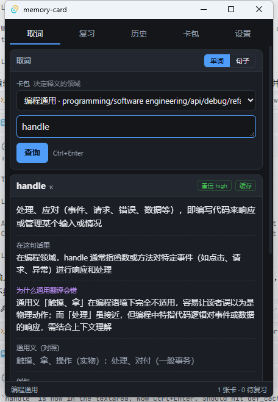 | 查 `handle`，置信度 high，右上角「缓存」标记说明这条释义来自本地 `def_cache` 而非重新请求模型 |
| 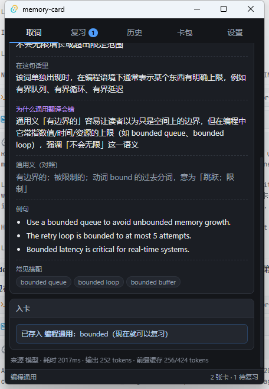 | 存 `bounded` 入「编程通用」，入卡提示已按 bug 修复后的形式显示；底部来源行给出 `2017ms / 输出 252 tokens / 前缀缓存 256/424 tokens` |
| 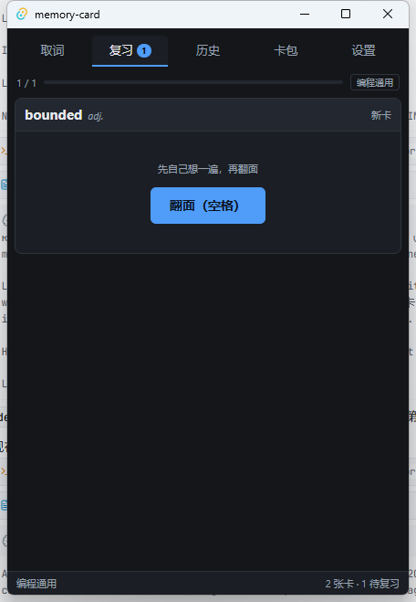 | 复习页对新卡显示"新卡"而非"上次间隔 0 分钟" |

UI 改版后的四张（同一轮 `pnpm tauri dev` 真实窗口，由 `scripts/ui-drive.ps1` 驱动）：

| 文件 | 说明 |
|---|---|
|  | 取词首屏：卡包下拉**只显名称**，领域关键词另起一行；**没有"单词 / 句子"开关**，标题栏写明"单词 / 句子自动识别"；无结果时底部无动作栏 |
| 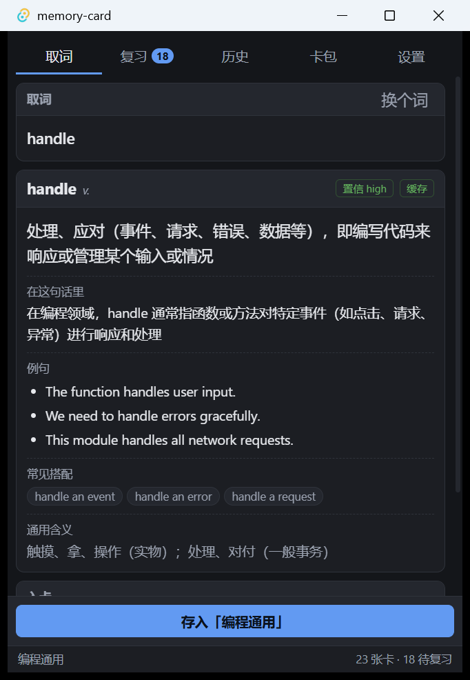 | 出结果后：输入区**收成一行**；释义顺序＝领域义（hero）→ 在这句话里 → 例句 → 常见搭配 → **通用含义（弱化收尾）**；**没有"为什么通用翻译会错"**；底部常驻动作栏「存入「编程通用」」**不滚动即可点**（其上方内容已溢出，正说明动作栏确实固定） |
| 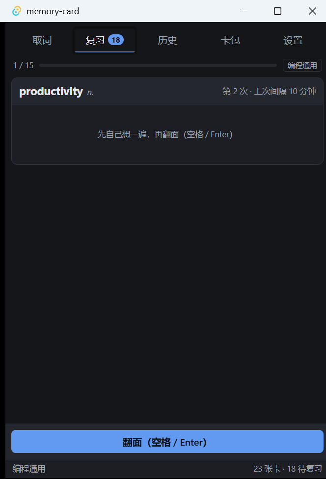 | 复习正面：`翻面（空格 / Enter）`固定在底部动作栏；此处也是"结果页 Tab 到别的标签页再按 Enter 会切页而不是入库"的现场 |
| 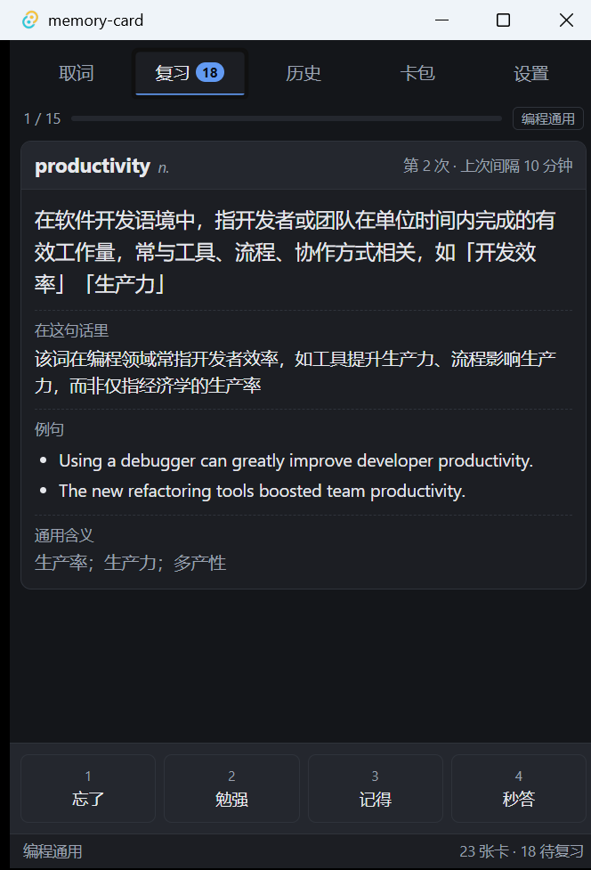 | 复习背面：`1–4 忘了/勉强/记得/秒答`评分行整体移入底部动作栏；正文同样是"领域义 → 细节 → 通用含义"且无 `why` |

release 打包产物的一张（`pnpm tauri dev` 之外的独立进程，cwd 不含 `.env`）：

| 文件 | 说明 |
|---|---|
| 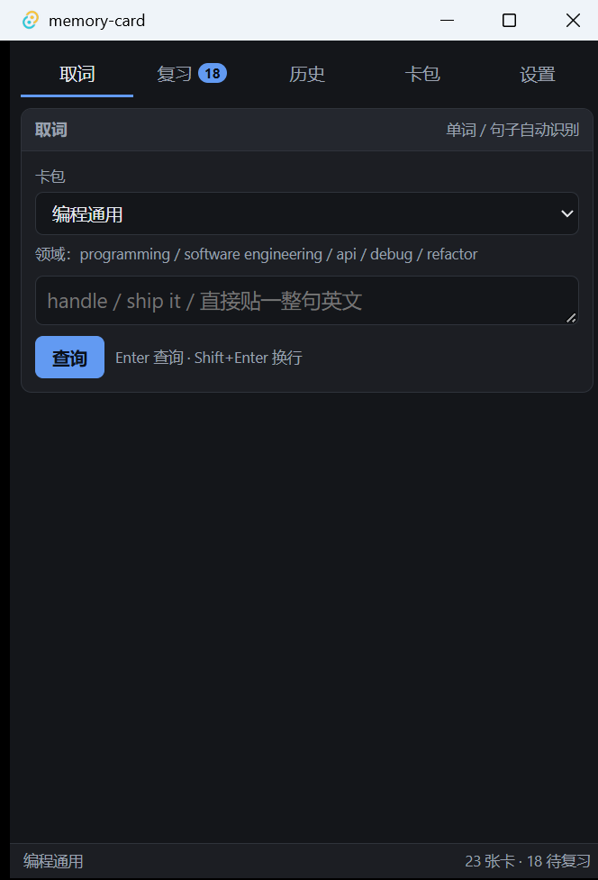 | `target/release/memory-card.exe` 独立启动：界面完整（不是白窗）、底部状态栏 `23 张卡 · 18 待复习` 说明 SQLite 正常打开、卡包/领域行正常 |

这张抓图用的是 `DwmGetWindowAttribute(DWMWA_EXTENDED_FRAME_BOUNDS)` 取物理框 + `PrintWindow(hwnd, hdc, 2)`（`PW_RENDERFULLCONTENT`，否则 WebView2 会截出空白）—— 曾经是内联写法，现在这段逻辑已经落进 `scripts/win-shot.ps1`，`shot-window.ps1` / `ui-drive.ps1` 都 dot-source 它，两处不会再漂移。

## 5. 仍未验证 / 仍未实现

**仍未验证**：

* **拖拽取词的端到端驱动**：分类器过滤规则有 `node --test scripts/check-dragdrop.ts` 覆盖，用户也已在真实窗口确认「拖一下即出释义」可用；但尚未用 `scripts/ui-drive.ps1` 留证据截图（§4 的三张截图不含拖拽）。
* **`scripts/ui-drive.ps1` 的交互限制**（见 §7 末尾）：坐标点击**不会**让输入框获得焦点；`-Keys` 里连续 `{TAB}` 会被丢掉（发 10 次落地约 2 次）。可靠的路径只有两条：点按钮、或往**已经聚焦**的输入框里粘贴 / 打字。这两条都已写进脚本注释。
* **句子流程 B**：UI 已去掉"单词 / 句子"开关（改由分类器自动判断），但"整句大意 + 难点词列表、逐条入卡"**未实现** —— 句子与单词仍共用同一个单次释义 prompt。抽词质量**没实测**。
* **几十张卡规模下的复习性能与滚动体验**没压测。
* **费用**：只在单次查询尺度上看过 token 数，没有按天累计的账。
* 未做同类工具对照（EasyDict / Bob / GoldenDict / Anki / 沉浸式翻译）。

**仍未实现**：

* **一键入库的 `E 编辑后存入`**（P0 第 5 项）：`Enter 存入` / `Esc 丢弃` 已实现；`E 编辑后存入` 未实现 —— 缺释义手工编辑界面（P1 第 10 项）。
* **托盘图标与到期通知**：`Cargo.toml` 里开了 `tauri` 的 `tray-icon` feature，但没有任何托盘代码 —— 目前只是把编译开关打开了，功能不存在。
* 剪贴板监听**已移出范围**（PRD §2 非目标），不再列为待办。原先"按下 Ctrl+C 就出释义"的那套体验设计与成功指标随之作废。

## 6. 自己复现

```powershell
# 1. 只验模型侧（不发 Tauri，最省事）
pwsh scripts/probe-deepseek.ps1 -DryRun      # 先看请求体，不发请求
pwsh scripts/probe-deepseek.ps1              # 真发一次，打印耗时 / 缓存 / confidence

# 2. 自动化测试（前端分类器在仓库根跑）
node --test scripts/check-dragdrop.ts

cd src-tauri
cargo test
cargo test --test live_llm -- --nocapture

# 3. 出独立 exe 再看真实窗口
cd ..
pnpm tauri build --debug --no-bundle
# 注意：必须传仓库根作 cwd，否则 dotenvy 找不到 .env
$exe = "$PWD\src-tauri\target\debug\memory-card.exe"
([wmiclass]'Win32_Process').Create($exe, $PWD.Path, $null)
```

一个会让上面第 3 步白费的坑：**跑过 `cargo test` 之后必须先重新 `pnpm tauri build`**，否则 exe 是编译期指向 `devUrl`(1420) 的那个版本，窗口会直接报 `ERR_CONNECTION_REFUSED`。详见 [DEVELOPMENT.md](DEVELOPMENT.md)。

## 7. 缺陷复修（2026-09-19 第二轮）

第一轮验证是"按 PRD 走一遍"，全绿；这一轮是**用户拿 `release/0.1.0` 双击起来真用**之后报回来的。三个问题都有同一个味道：**页面在动、数据也在，但两者对不上**。

### 7.1 切页丢结果（用户报：切标签页再回「取词」，全空了）

**根因**：`App.tsx` 里五个视图是条件渲染（`tab === "lookup" ? <LookupView/> : …`），切页就是**卸载**。`LookupView` 的 `input` / `result` / `saved` 全在组件局部 state 里 —— 组件没了，状态就没了，回来的是一张崭新的取词页。动作栏是一个副作用注册，组件一卸载它也一起消失。

**修法**：把取词页改成**常驻挂载、只切 `display`**（`<div hidden={tab !== "lookup"}>`，`styles.css` 的 `.content` 补 `[hidden]{display:none}` 防止被自己的 display 规则盖掉）。其余页仍按需挂载 —— 历史必须重新查库才能看到刚存的卡、复习必须重新查库才能看到刚到期的卡，卸载是它们的正确行为，只有取词页的结果没有第二次机会。

常驻的代价是后台页会一直抢动作栏和全局键盘，所以补了一个显式契约：`useActionBar(node, deps, active = true)`，`active` 为假就不注册；取词页的 keydown 监听开头 `if (!active) return`。**没有这一步，在复习页按 `Esc` 会把后台那张取词页的结果清掉** —— 这是改完之后新引入又立刻修掉的问题，试出来的（见 7.4）。

### 7.2 已有卡却说"存入"（用户报：历史点一条，下面还提示存入）

**根因**：后端 `lookup_term` **本来就返回** `existing_in_deck`，前端拿到了却没人用 —— 动作栏文案是写死的「存入「deck」」。于是同一屏上，入卡面板写着"当前卡包已有这个卡"，底下的主按钮却写着"存入"。

**修法**：`const existing = result?.existing_in_deck ?? null;`，有卡时主操作变成「**更新**「deck」释义」，旁边补一句只读的「已有卡 · 复习 N 次」；没卡时还是「存入「deck」」。存完的提示也改成用后端返回的 `saved.deck_name`（JOIN 出来的真值），而不是 `result.deck_name` —— 见 7.3，这两者会不一样。

### 7.3 存进哪个卡包（顺带查出来的第三处）

**根因**：动作栏文案用的是 `result.deck_name`，而 `save()` 用的是 App 那个下拉框的 `deckId` —— 两者可以不同。更麻烦的是这个不同**有实质后果**：`term_key` 里嵌了 `deck_id`，释义又是按卡包关键词算出来的，存到别的卡包既跨了领域、又会多出一张卡。

**修法**：

* `save()` 改为存入 `result.deck_id`（`deps` 收成 `[result, onSaved]`，不再依赖下拉框状态）。
* 从历史点一条时，`pickHistory` 连卡包一起切（`pickDeck(item.deck_id)`），卡片上下的卡包是一致的。

验证方式：把下拉框留在「前端」、结果却来自「编程通用」，点存入 —— 卡片进了「编程通用」。截图 `ui-09`。

### 7.4 证据（全部来自真实窗口，`mc-probe.exe`）

改动涉及前端 + 脚本，后端与 prompt 未动。重跑 `npx tsc --noEmit`（0 退出）、`pnpm build`（30 modules，247.94 kB / gzip 77.93 kB）。

取证用的是一个**改名的调试副本 `mc-probe.exe`**：用户此刻正开着 `memory-card.exe`，同名的第二个实例会互相干扰（也会抢同一份 SQLite），改名后两者互不影响。

| 文件 | 说明 |
|---|---|
| 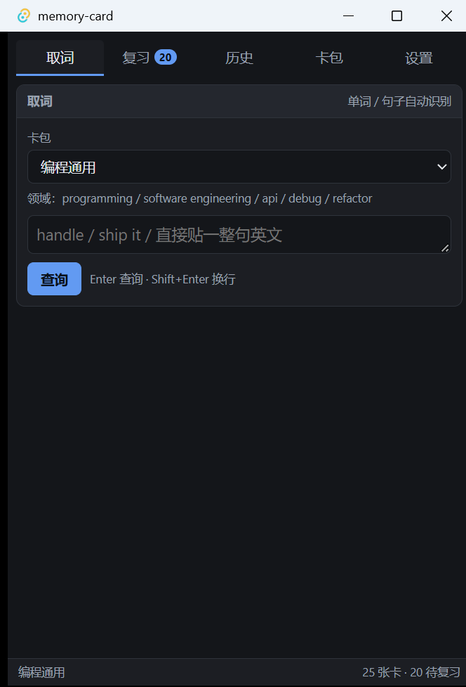 | 复现 bug 1：结果页正常，此时切走 |
|  | 修复后：复习 → 取词，**结果、`已有卡 · 复习 1 次`、`更新「编程通用」释义` 全在**，输入框里的 `handle` 也还在 |
| 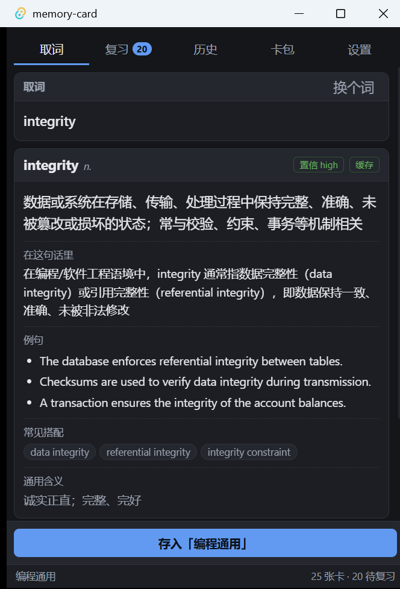 | 复现 bug 2：从历史点一条已有卡，底部仍写「存入」 |
|  | 修复后：同一动作显示「已更新「编程通用」释义」，输入框 `handle`，卡包 `编程通用` |
| 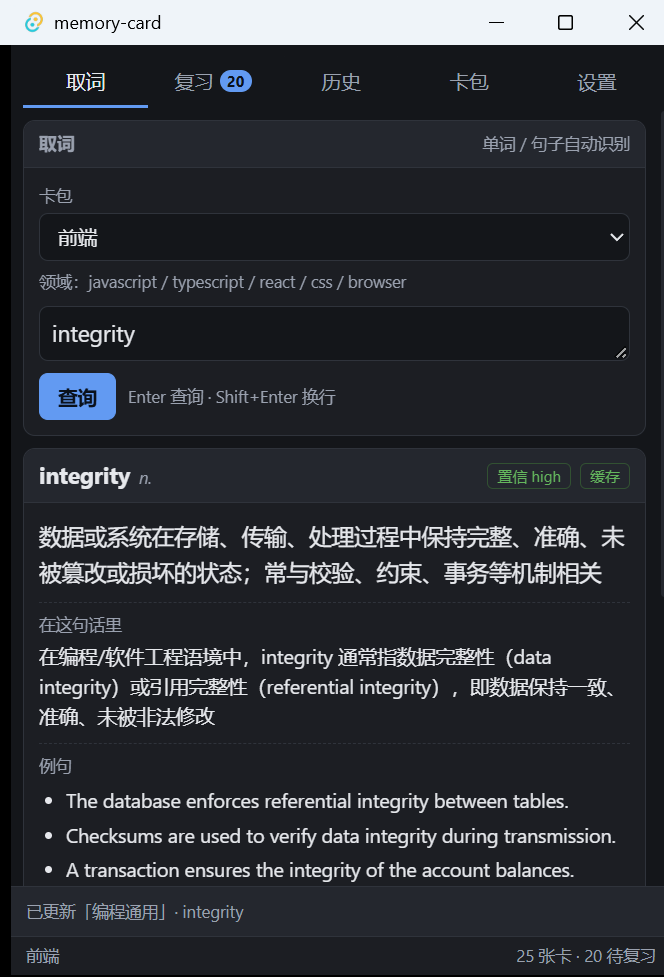 | 下拉框停在前端、结果来自编程通用，点存入 → `已存入 编程通用：handle`，**证明存入目标取 `result.deck_id` 而非下拉框** |
| 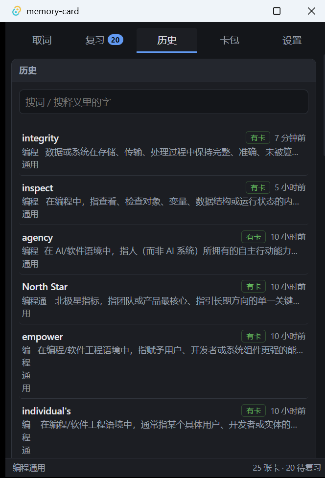 | 复现显示 bug：卡包名被挤成一列竖排字「编 程 通 用」，整行横向溢出 |
| 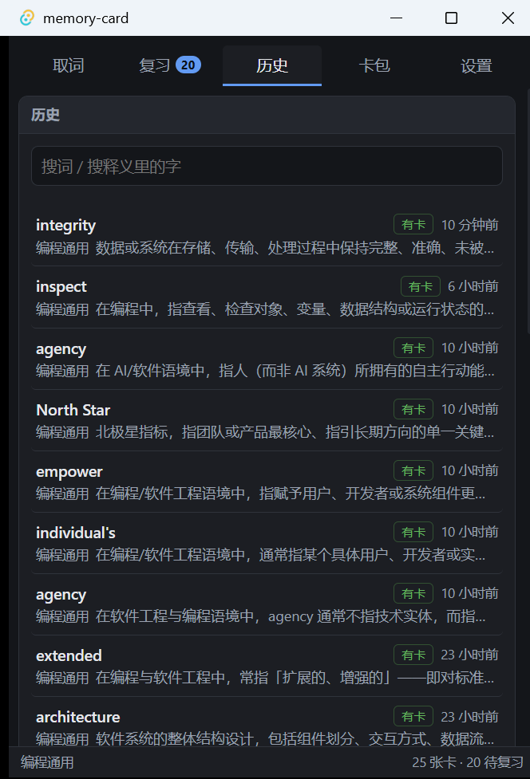 | 修复后：卡包名完整，释义去省略号 |

顺带修掉的历史页布局问题：`.history-def` 是 `nowrap` 的 flex 项，默认 `min-width:auto` 让它撑到 min-content（=整行），被挤扁的反而是旁边的卡包名。给 `.history-def` 补 `min-width:0`、给卡包名补 `flex:0 0 auto` 之后，省略号才落在释义上。

还验到的两点：后台那张取词页的 `Esc` **不会**清掉它的结果（切到复习页按 `Esc`，回取词页结果仍在）；复习页自己的动作栏与评分键没被 `active` 契约弄坏。

**上面这一组验的是调试版（`mc-probe.exe`）。** 光验调试版不够 —— 交付给用户的是发布版，打包配置和优化都可能改变行为。所以把 `release/0.1.1/` 里那个真·发布 exe 也跑了一遍（改名 `mc-rel011.exe`，避开用户自己开着的那个实例，并让它和用户实例共用同一个 `%APPDATA%` 数据库）：

| 文件 | 说明 |
|---|---|
| 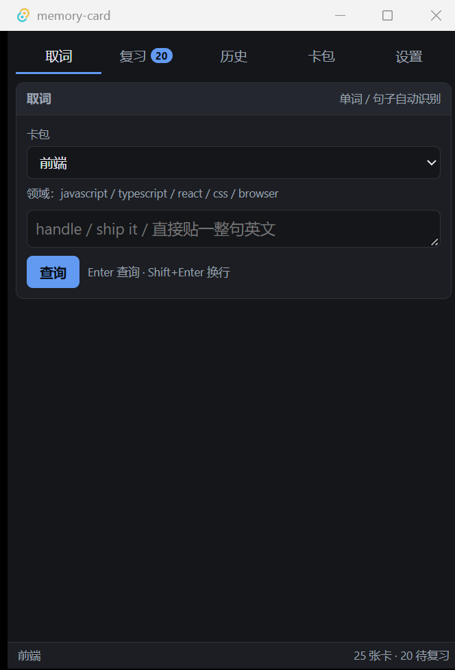 | `release/0.1.1/memory-card.exe` 独立启动（cwd 不含 `.env`）：界面完整、`25 张卡 · 20 待复习` —— 读的是真实数据库 |
|  | 发布版里从历史点一条：结果出来（右上角`缓存`，说明命中 `def_cache`、没花钱）、底部写「已有卡 · 复习 0 次」+「更新「编程通用」释义」、左下角卡包跟着变成`编程通用` |
| 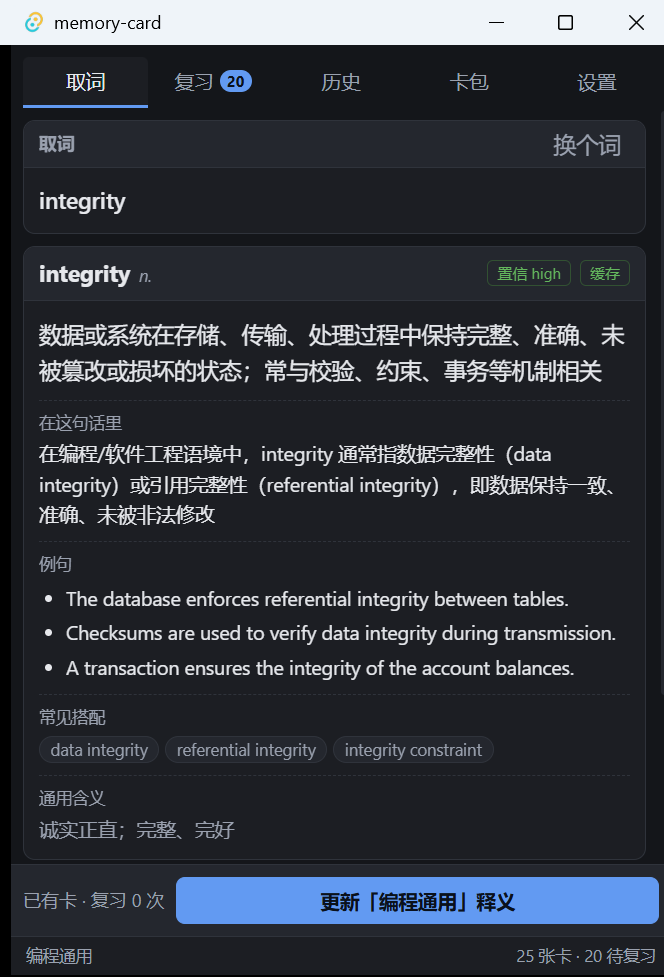 | 发布版里切到`复习`再切回`取词`：**结果原封不动还在** |

这三张里没有任何键入动作 —— 是**从历史点一条**触发的查询。这也是被逼出来的：驱动脚本点文本框**不会**把焦点给它（见 7.5），所以"打字进输入框"这条路走不通，改用"点一条历史记录"绕开键盘。副作用是这条路同时把 7.2 / 7.3 一起验了。

### 7.5 修 bug 时踩到的取证工具问题

* `shot-window.ps1` 的 DPI 缺陷**这次真修了**：抽成 `scripts/win-shot.ps1`（`DwmGetWindowAttribute` 物理框 + `PrintWindow(...,2)` + `IsIconic` 守卫 + 采样 8 像素判断是否白窗），`shot-window.ps1` 与 `ui-drive.ps1` 都 dot-source 它，不再各写一份。
* `ui-drive.ps1` 的两条限制（本轮实测确认，已写进脚本注释）：**坐标点击不会让输入框获得焦点** —— 不是"间歇性失败"，是点了之后 `-Paste` 十次都不落（点击本身没问题，同一套坐标点标签页每次都对，映射早就校准过）；`-Keys` 里连续 `{TAB}` 会被丢掉（发 10 次大约只落地 2 次）。可靠的做法只剩"点按钮"。**要让它查出东西，别去纠结怎么把字弄进输入框，点一条历史记录就行** —— 取词页的入口本来就有两条，历史点击那条完全不需要键盘。
* 但"点历史"有个前提：库里得已经有记录。空库上这台机器跑不了纯驱动流程，那一段只能靠人手。
* 另外 `-ClickAt` 用的是**虚拟化后的** `GetWindowRect` 坐标 —— 这是故意的，因为 `SetCursorPos` 也是 DPI 不敏感的。截图不能照抄这套坐标（见 §5 / 坑 8）。

还有一个**没查清的现象**，记在这里免得下次以为是幻觉：`release/0.1.1` 的 MSI 生成于 23:07:22，`candle`/`light` 之后 5 秒（23:07:27）Application 日志里出现了 `MsiInstaller` 的一条"已安装产品 memory-card 0.1.1，状态 0"。打包器自己不会装东西，当时也没有任何人手工装（机器上 `HKLM` / `HKCU` 的 Uninstall 键里**没有** memory-card 条目，即现在什么都没装上）。同一时间点，用户之前开着的那个 `Downloads\memory-card.exe` 实例也不在了。两件事**可能**相关（安装 MSI 会经 Restart Manager 关掉占用同款 WebView2 的进程），但我没有证据链，不写成结论。教训是实的：**不要在用户正开着应用的数据库上再起一个实例跑验证** —— 要用就等对方没开着，或者先把库复制一份出来用。
* 版本从 `0.1.0` 抬到 `0.1.1`（`package.json` / `tauri.conf.json` / `Cargo.toml`），好让修好的安装包和用户手上那个区分开。**不需要迁移**：数据在 `%APPDATA%`，identifier 没变。
